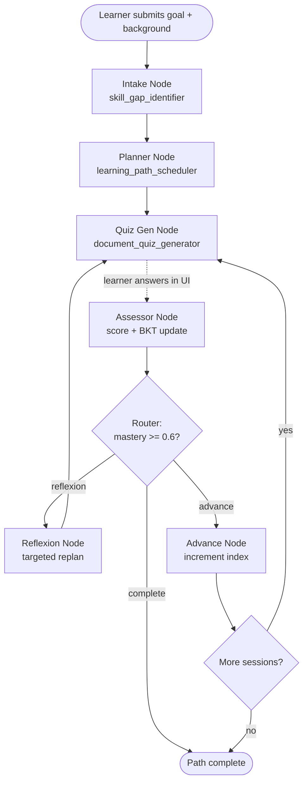

# PathFinder — Adaptive Learning Path Engine

An AI-powered learning companion that doesn't just generate a course list once — it **tests, measures, and re-plans** as the learner actually progresses. Built on a real prerequisite skill graph, Bayesian Knowledge Tracing for honest mastery estimation, and a LangGraph state machine that closes the loop between assessment and curriculum design.

## The problem

Most "AI learning path" tools generate a static list of courses from a single prompt and never revisit it. Learners have different backgrounds, skill gaps, and paces — a plan that doesn't adapt to how they're actually doing isn't personalized, it's just a list.

## Our approach

PathFinder treats personalized learning as a **closed loop**, not a one-shot generation:

1. A learner describes their goal in plain English.
2. An LLM agent identifies specific skill gaps against that goal.
3. A scheduler builds an ordered learning path over a real, validated prerequisite graph.
4. The learner takes a short quiz on each session.
5. **Bayesian Knowledge Tracing** — not another LLM guess — updates a probabilistic mastery estimate from the quiz result.
6. If mastery is too low, the path is **re-planned in real time**, inserting a remedial session before the one the learner struggled with.

This closed feedback loop is the core technical differentiator: the plan changes based on evidence, not just at the start.

---

## Requirements coverage

| Requirement | Where it lives |
| --- | --- |
| Conversational interface for goals in natural language | `frontend/src/components/ChatIntake.jsx` → `code/nodes.py::intake_node` |
| Learner profiling engine (interests, level, completed courses, objectives) | `code/profile_builder.py` (structured extraction) → `learner_profile` in `code/state.py`, surfaced via `GET /session/{id}/profile` and `frontend/src/components/ProfileCard.jsx` |
| Recommendation engine (courses, projects, resources) | `code/learning_path_scheduler.py::RecommendedResource` — every session includes 1–3 concrete resources, rendered in `frontend/src/components/RoadmapView.jsx` |
| Personalized learning path generator with prerequisites and milestones | `code/skill_graph/` (prerequisite DAG) + `code/learning_path_scheduler.py` |
| AI assistant explaining *why* each recommendation was made + answering queries | `code/explainer_agent.py`, exposed via `POST /session/{id}/explain`, UI in `frontend/src/components/ExplainPanel.jsx` ("Why this?" on every session) |
| Dashboard visualizing progress, skill development, milestones, next actions | `frontend/src/components/ProgressDashboard.jsx` (BKT mastery per skill, completion %, replan count) |

---

## Architecture



Mastery is tracked per-skill with the standard Corbett & Anderson (1994) BKT update — pure probability math, no LLM call involved, which makes it the most interpretable and defensible part of the system.

---

## Repo structure

```
Learning-Path/
├── code/                          # LangGraph orchestration + LLM agents
│   ├── main.py                    # FastAPI app — wraps the graph in HTTP endpoints
│   ├── llm.py                     # Shared LLM client (OpenAI, via .env)
│   ├── state.py                   # Shared LangGraph state schema
│   ├── nodes.py                   # intake / planner / quiz_gen / assessor / reflexion / advance
│   ├── router.py                  # Conditional routing: advance / reflexion / complete
│   ├── graph_builder.py           # Compiles the StateGraph with a checkpointer
│   ├── base_agent.py              # LLM call wrapper with JSON-repair parsing
│   ├── skill_gap_identifier.py    # Goal + background -> structured skill gaps
│   ├── skill_gap_prompts.py       # Prompts for skill gap identification
│   ├── learning_path_scheduler.py # schedule() / reflexion() / reschedule()
│   ├── document_quiz_generator.py # Per-skill quiz generation + scoring
│   ├── bkt_update.py              # Bayesian Knowledge Tracing (pure math)
│   └── test_*.py                  # End-to-end scripts for each stage of the loop
│
├── skill_graph/                   # Prerequisite graph (data layer)
│   ├── nodes.json / edges.json    # Curriculum skill graph
│   ├── build_graph.py             # NetworkX DAG construction + cycle validation
│   └── query.py                   # get_path(), get_prerequisites()
│
├── mastery/                       # Persistent (SQLite) mastery store
│   ├── models.py
│   └── store.py                   # Drop-in replacement for bkt_update.MasteryStore
│
├── frontend/                      # React + Vite UI
│   └── src/
│       ├── components/
│       │   ├── ChatIntake.jsx
│       │   ├── RoadmapView.jsx
│       │   ├── QuizPanel.jsx
│       │   └── ProgressDashboard.jsx
│       ├── api/client.js          # Talks to the backend; falls back to a local mock if unreachable
│       └── App.jsx
│
└── requirements.txt
```

---

## API

| Method | Endpoint | Description |
|---|---|---|
| `POST` | `/session/start` | Runs intake through the first quiz generation; returns skill gaps, path, and first quiz |
| `POST` | `/session/{id}/quiz/answer` | Submits answers; runs BKT assessment and routes to advance or reflexion |
| `GET` | `/session/{id}/state` | Returns the current full session state |
| `GET` | `/health` | Health check |

Sessions persist across requests via LangGraph's checkpointer, keyed by `session_id` as the thread ID.

---

## Tech stack

| Layer | Choice | Why |
|---|---|---|
| Orchestration | **LangGraph** | Native support for the cyclical replan loop — a plain chain can't express "quiz fails → route back to planner" cleanly |
| LLM calls | **LangChain** + OpenAI | Structured JSON output for skill-gap identification, path scheduling, and quiz generation |
| Mastery model | **Bayesian Knowledge Tracing** (pure Python, no ML training required) | Real-time updatable from a single quiz answer, fully interpretable — no training data needed in a week |
| Skill graph | **NetworkX** | Prerequisite DAG with cycle validation |
| Backend | **FastAPI** | Thin HTTP layer over the compiled graph |
| Frontend | **React + Vite** | Chat intake, visual roadmap, quiz UI, mastery dashboard |
| Persistence | **SQLite** (`mastery/store.py`) / in-memory (`MemorySaver` checkpointer) | Swappable depending on demo needs |

---

## Running locally

### Backend
```bash
cd code
python3 -m pip install -r ../requirements.txt
echo "OPENAI_API_KEY=sk-your-key" > .env
uvicorn main:app --reload --port 8000
```

### Frontend
```bash
cd frontend
npm install
npm run dev
```
Open [http://localhost:5173](http://localhost:5173). If the backend isn't reachable, the frontend automatically falls back to a local mock engine with real BKT math client-side, so UI work isn't blocked by backend availability.

### Testing the core loop directly
```bash
cd code
python3 test_pipeline.py     # intake -> planner -> quiz generation
python3 test_assessment.py   # + correct answers -> mastery update -> advance
python3 test_reflexion.py    # + incorrect answers -> reflexion triggers -> path changes
```
