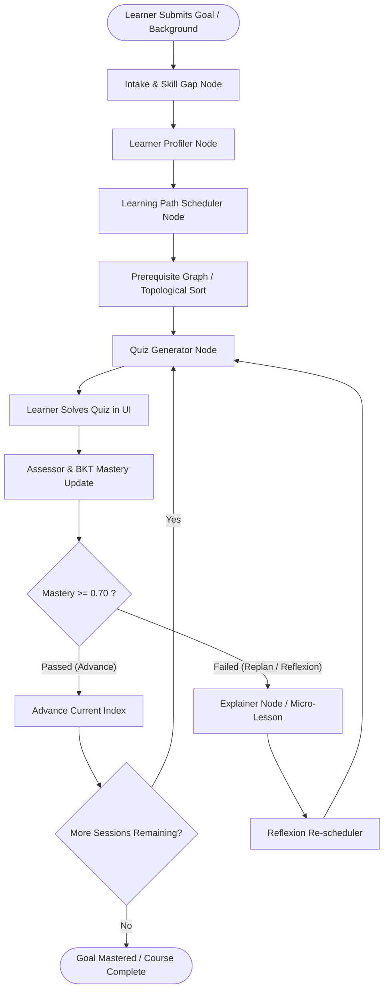

# Adaptive Learning Path Engine (LangGraph + BKT + NetworkX)

An intelligent, adaptive curriculum and learning-path recommendation engine. It leverages **Bayesian Knowledge Tracing (BKT)** for probabilistic mastery tracking, **NetworkX** for topological prerequisite graphs, **LangChain / LLMs** for skill gap extraction and quiz generation, and **LangGraph** to coordinate multi-agent adaptive routing and dynamic replanning.

---

## Architecture & System Flow



---

## Repo Structure & File Ownership

```
project-root/
├── backend/
│   ├── main.py                          # FastAPI entrypoint & server init
│   ├── requirements.txt                 # Backend Python dependencies
│   │
│   ├── code/                            # [GAURAV] Core Agentic & Math Modules
│   │   ├── base_agent.py                # Base LangChain structured caller + JSON repair
│   │   ├── skill_gap_identifier.py      # LLM intake -> structured skill gaps & levels
│   │   ├── skill_gap_prompts.py         # System & task prompts for skill gap extraction
│   │   ├── learning_path_scheduler.py   # Initial scheduling, reflexion & replan agents
│   │   ├── document_quiz_generator.py   # LLM MCQ question generator with explanations
│   │   └── bkt_update.py                # Pure Corbett & Anderson Bayesian Knowledge Tracing
│   │
│   ├── graph/                           # [LANGGRAPH PAIR] State Machine & Orchestration
│   │   ├── state.py                     # Central TypedDict / Pydantic state schema
│   │   ├── nodes.py                     # LangGraph nodes wrapping code/ and custom nodes
│   │   ├── router.py                    # Conditional edge routing (advance vs reflexion)
│   │   └── graph_builder.py             # Compiled StateGraph with checkpointer
│   │
│   ├── skill_graph/                     # [PERSON C] Prerequisite Graph & Data Layer
│   │   ├── nodes.json                   # Skill definitions, taxonomy & metadata
│   │   ├── edges.json                   # Directed prerequisite edges (A -> B)
│   │   ├── build_graph.py               # NetworkX graph constructor & validator
│   │   └── query.py                     # Topological traversal & prerequisite lookups
│   │
│   ├── mastery/                         # [PERSON C / LANGGRAPH PAIR] Persistence Store
│   │   ├── models.py                    # SQLite / SQLAlchemy user mastery models
│   │   └── store.py                     # Read/Write helper functions for user mastery
│   │
│   └── api/                             # [LANGGRAPH PAIR] REST API Layer
│       ├── routes.py                    # FastAPI route handlers (/session/start, etc.)
│       └── schemas.py                   # Pydantic request/response schemas
│
└── frontend/                            # [PERSON D] React / Vite Frontend
    └── src/
        ├── components/
        │   ├── ChatIntake.jsx           # Goal onboarding & conversational intake
        │   ├── RoadmapView.jsx          # Interactive visual curriculum roadmap
        │   ├── QuizPanel.jsx            # MCQ quiz interface & answer submission
        │   └── ProgressDashboard.jsx    # BKT mastery radar/bar charts & live state
        ├── api/
        │   └── client.js                # Axios/Fetch API client communicating with backend
        ├── App.jsx                      # Main dashboard layout & state management
        └── main.jsx                     # Vite React entrypoint
```

---

## Detailed Component Specifications

### 1. Gaurav's Modules (`backend/code/`)

All modules in `code/` are self-contained, typed, and validated with Pydantic.

#### `base_agent.py`
- **Class**: `BaseAgent(model: BaseChatModel, system_prompt: str, jsonalize_output: bool = True)`
- **Key Methods**:
  - `invoke(inputs: Dict[str, Any], task_prompt: Optional[str] = None) -> Any`
- **Purpose**: Robust JSON parsing with automated markdown code fence stripping (` ```json `), regex brace isolation, and trailing comma repair.

#### `skill_gap_identifier.py` & `skill_gap_prompts.py`
- **Classes**: `SkillGap`, `SkillGaps`, `SkillGapIdentifier`
- **Exposes**:
  ```python
  def identify_skill_gaps_with_llm(llm: BaseChatModel, learner_profile: Dict[str, Any]) -> dict
  ```
- **Output Shape**:
  ```json
  {
    "skill_gaps": [
      {
        "name": "SQL Joins",
        "is_gap": true,
        "required_level": "intermediate",
        "current_level": "beginner",
        "reason": "Learner knows basic SELECT but lacks multi-table experience.",
        "level_confidence": "high"
      }
    ]
  }
  ```

#### `learning_path_scheduler.py`
- **Classes**: `DesiredOutcome`, `SessionItem`, `LearningPath`, `LearningPathScheduler`
- **Exposes**:
  ```python
  def schedule_learning_path_with_llm(llm: BaseChatModel, learner_profile: Dict[str, Any]) -> dict
  def reflexion_learning_path_with_llm(llm: BaseChatModel, learning_path: Sequence[Any], feedback: Dict[str, Any]) -> dict
  def reschedule_learning_path_with_llm(llm: BaseChatModel, learning_path: Sequence[Any], learner_profile: Dict[str, Any]) -> dict
  ```
- **Output Shape**:
  ```json
  {
    "learning_path": [
      {
        "id": "Session 1",
        "title": "Mastering SQL Inner and Outer Joins",
        "abstract": "Deep dive into multi-table relational queries.",
        "if_learned": false,
        "associated_skills": ["SQL Joins", "Relational Algebra"],
        "desired_outcome_when_completed": [
          { "name": "SQL Joins", "level": "intermediate" }
        ]
      }
    ]
  }
  ```

#### `document_quiz_generator.py`
- **Classes**: `SingleChoiceQuestion`, `SkillQuiz`, `DocumentQuizGenerator`
- **Exposes**:
  ```python
  def generate_quiz_with_llm(llm: BaseChatModel, skill_id: str, skill_description: str, question_count: int = 3) -> dict
  ```
- **Output Shape**:
  ```json
  {
    "skill_id": "sql_joins",
    "questions": [
      {
        "question": "Which join returns all records when there is a match in either left or right table?",
        "options": ["INNER JOIN", "FULL OUTER JOIN", "LEFT JOIN", "CROSS JOIN"],
        "correct_option_index": 1,
        "explanation": "FULL OUTER JOIN returns all matching and non-matching rows from both tables."
      }
    ]
  }
  ```

#### `bkt_update.py`
- **Pure Math**: Corbett & Anderson 1994 standard formulation.
- **Parameters**:
  - `prob_mastery` ($P(L_0) = 0.10$): Prior belief of knowledge.
  - `prob_slip` ($P(S) = 0.10$): Probability of making an error despite knowing the skill.
  - `prob_guess` ($P(G) = 0.25$): Probability of answering correctly by guessing.
  - `prob_transit` ($P(T) = 0.30$): Probability of acquiring the skill after a learning event.
- **Exposes**:
  ```python
  def update_mastery(prob_mastery: float, prob_slip: float, prob_guess: float, prob_transit: float, is_correct: bool) -> float
  def update_user_skill_mastery(skill_params: Dict[str, BKTParams], skill_id: str, is_correct: bool) -> float
  ```

---

### 2. LangGraph State Machine (`backend/graph/`)

#### `state.py` (Build this FIRST)
Defines the shared state dictionary passed across all nodes in the state graph.

```python
from typing import TypedDict, List, Dict, Any, Optional

class LearningState(TypedDict):
    session_id: str
    user_id: str
    user_goal: str
    user_background: str
    learner_profile: Dict[str, Any]
    skill_gaps: List[Dict[str, Any]]
    mastery: Dict[str, float]              # e.g., {"sql_joins": 0.82, "indexing": 0.35}
    current_path: List[Dict[str, Any]]     # List of SessionItem dicts
    current_index: int                     # Index of active session
    last_quiz: Optional[Dict[str, Any]]    # Current SkillQuiz object
    last_quiz_submission: Optional[List[int]] # Indices chosen by user
    last_quiz_score: Optional[float]       # Proportion correct (0.0 to 1.0)
    explanation: Optional[str]             # Micro-lesson text generated if failed
    is_completed: bool
    replan_count: int
```

#### `nodes.py`
Implements the LangGraph graph nodes:
1. **`intake_node(state)`**: Calls `identify_skill_gaps_with_llm` using `user_goal` and `user_background`.
2. **`profiler_node(state)`**: Normalizes skill gaps and queries `skill_graph/query.py` to establish topological prerequisites.
3. **`planner_node(state)`**: Calls `schedule_learning_path_with_llm` to produce the ordered `current_path`.
4. **`quiz_gen_node(state)`**: Fetches the active skill from `current_path[current_index]` and calls `generate_quiz_with_llm`.
5. **`assessor_node(state)`**: Evaluates user answers, computes score, calculates `is_correct = score >= 0.67`, and updates `state.mastery[skill_id]` via `update_mastery`.
6. **`explainer_node(state)`**: Generates a targeted micro-lesson and explanation for missed quiz questions.
7. **`reflexion_node(state)`**: Invokes `reflexion_learning_path_with_llm` to splice remedial sessions into `current_path`.

#### `router.py`
Conditional edge evaluator:
```python
def route_after_assessment(state: LearningState) -> str:
    current_skill = state["current_path"][state["current_index"]]["associated_skills"][0]
    current_mastery = state["mastery"].get(current_skill, 0.0)
    
    if current_mastery >= 0.70:
        if state["current_index"] + 1 >= len(state["current_path"]):
            return "complete"
        return "advance"
    else:
        return "replan"
```

#### `graph_builder.py`
Builds and compiles the `StateGraph`:
```python
from langgraph.graph import StateGraph, END
from langgraph.checkpoint.memory import MemorySaver

def build_graph():
    builder = StateGraph(LearningState)
    builder.add_node("intake", intake_node)
    builder.add_node("profiler", profiler_node)
    builder.add_node("planner", planner_node)
    builder.add_node("quiz_gen", quiz_gen_node)
    builder.add_node("assessor", assessor_node)
    builder.add_node("explainer", explainer_node)
    builder.add_node("reflexion", reflexion_node)
    
    builder.set_entry_point("intake")
    builder.add_edge("intake", "profiler")
    builder.add_edge("profiler", "planner")
    builder.add_edge("planner", "quiz_gen")
    
    # After user answers quiz, execution resumes at assessor
    builder.add_conditional_edges(
        "assessor",
        route_after_assessment,
        {
            "advance": "quiz_gen",
            "replan": "explainer",
            "complete": END
        }
    )
    builder.add_edge("explainer", "reflexion")
    builder.add_edge("reflexion", "quiz_gen")
    
    return builder.compile(checkpointer=MemorySaver(), interrupt_before=["quiz_gen"])
```

---

### 3. Skill Graph & Data Layer (`backend/skill_graph/` & `backend/mastery/`)

#### `nodes.json` & `edges.json`
- Defines nodes (skills with tags, descriptions, difficulty) and directed edges (`source` is prerequisite to `target`).

#### `build_graph.py` & `query.py`
- Exposes:
  - `def get_prerequisites(skill_id: str) -> List[str]`
  - `def get_path(known_skills: List[str], goal_skill: str) -> List[str]` (topological ordering of missing dependencies).

#### `mastery/store.py`
- SQLite store for persistent user tracking across sessions:
  - `def get_mastery(user_id: str, skill_id: str) -> float`
  - `def set_mastery(user_id: str, skill_id: str, value: float) -> None`

---

### 4. API Endpoints (`backend/api/`)

FastAPI routes exposing the LangGraph workflow:

| Method | Endpoint | Request Body | Response Body | Description |
| :--- | :--- | :--- | :--- | :--- |
| `POST` | `/session/start` | `StartSessionRequest` | `SessionStateResponse` | Starts intake, runs planner, returns first quiz & roadmap |
| `POST` | `/session/{id}/quiz/answer` | `QuizAnswerRequest` | `SessionStateResponse` | Submits answers, runs BKT assessor, routes to next quiz or reflexion |
| `GET` | `/session/{id}/state` | _None_ | `SessionStateResponse` | Returns current roadmap, active session, BKT mastery scores, and quiz |
| `POST` | `/session/{id}/replan` | `GoalChangeRequest` | `SessionStateResponse` | Manually triggers full reschedule on changed goal |

---

### 5. Frontend (`frontend/src/`)

Person D can develop immediately by mocking the `SessionStateResponse` JSON.

- **`ChatIntake.jsx`**: User inputs goal (e.g. *"I want to learn database optimization for backend engineering, I already know basic SQL"*).
- **`RoadmapView.jsx`**: Visual timeline/graph of `current_path`, highlighting `if_learned`, current session, and replanned nodes.
- **`QuizPanel.jsx`**: Displays `last_quiz` questions, captures selected radio options, and posts answers.
- **`ProgressDashboard.jsx`**: Live radar / progress bar displaying `mastery` probability values from BKT.

---

## Integration Workflow & Team Roadmap

```
[Phase 1: Contracts]  --->  State schema & API contract locked (Defined above)
[Phase 2: Parallel]   --->  LangGraph pair builds skeleton with mock nodes
                            Person C builds NetworkX skill graph
                            Person D builds React UI against mock API responses
                            Gaurav finalizes prompt tuning & edge-case validation
[Phase 3: Core Drop]  --->  Swap mock functions in graph/nodes.py with code/ modules
[Phase 4: Full Stack] --->  Hook FastAPI endpoints to compiled graph checkpointer
[Phase 5: UI Polish]  --->  Connect React UI client.js to live FastAPI server
```

### Mocking Guide for Quick Start

For LangGraph Pair & Person D, use this mock state payload:
```json
{
  "session_id": "demo-session-123",
  "user_id": "learner-01",
  "current_index": 0,
  "is_completed": false,
  "mastery": {
    "sql_basics": 0.95,
    "sql_joins": 0.35,
    "indexing": 0.10
  },
  "current_path": [
    {
      "id": "Session 1",
      "title": "Mastering SQL Joins",
      "abstract": "Inner, Left, and Outer joins explained with real queries.",
      "if_learned": false,
      "associated_skills": ["sql_joins"]
    },
    {
      "id": "Session 2",
      "title": "Database Indexing & Query Plans",
      "abstract": "B-Trees and query cost optimization.",
      "if_learned": false,
      "associated_skills": ["indexing"]
    }
  ],
  "last_quiz": {
    "skill_id": "sql_joins",
    "questions": [
      {
        "question": "Which join includes all rows from the left table and matched rows from the right?",
        "options": ["RIGHT JOIN", "LEFT JOIN", "INNER JOIN", "FULL JOIN"],
        "correct_option_index": 1,
        "explanation": "LEFT JOIN preserves all rows from the left table."
      }
    ]
  },
  "explanation": null
}
```

---

## Running Locally

### Backend
```bash
cd backend
python -m venv venv
source venv/bin/activate   # On Windows: venv\Scripts\activate
pip install -r requirements.txt
uvicorn main:app --reload --port 8000
```

### Frontend
```bash
cd frontend
npm install
npm run dev
```
Open [http://localhost:5173](http://localhost:5173) in your browser.
